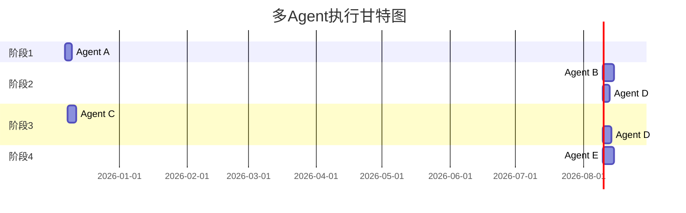

# 多 Agent 任务分配使用指南

> 本指南说明如何使用 5 个 AI Agent 协同完成 NexusArchive 优化计划

---

## 📁 任务说明书位置

```
docs/agents/
├── task-agent-a.md    # 后端安全工程师（第一阶段）
├── task-agent-b.md    # 合规开发工程师（第二阶段核心）
├── task-agent-c.md    # 前端架构师（第三阶段前端）
├── task-agent-d.md    # 基础设施工程师（OFD/ES/ERP）
└── task-agent-e.md    # 质量保障工程师（第四阶段）
```

---

## 🚀 执行顺序



---

## 💡 如何启动 Agent

### 方式一：Claude（推荐）

新开一个 Claude 会话，发送以下消息：

```
我需要你作为 NexusArchive 项目的 [角色名称]。

项目路径：/Users/user/nexusarchive

请先阅读以下文件了解项目规范：
- .agent/rules/general.md
- .agent/rules/expert-group.md

然后按照任务说明书执行：
[粘贴对应的 task-agent-X.md 内容]
```

### 方式二：Gemini 3 Pro

新开一个 Gemini 会话，发送以下消息：

```
你是 NexusArchive 电子会计档案系统的 [角色名称]。

## 项目背景
- 架构：模块化单体（非微服务）
- 后端：Java 17 + Spring Boot 3.x
- 前端：React 18 + TypeScript + Vite
- 数据库：PostgreSQL（支持达梦等国产数据库）
- 合规：必须符合 DA/T 94-2022、DA/T 92-2022

## 核心约束
1. 合规性 > 性能
2. 使用国密算法（SM2/SM3/SM4）
3. 私有化部署，不依赖公网

## 你的任务
[粘贴对应的 task-agent-X.md 内容]
```

---

## ✅ 进度追踪

完成任务后，在 `docs/优化计划.md` 中更新状态：

- 📋 待执行 → 🔄 执行中 → ✅ 完成

---

## ⚠️ 注意事项

1. **Agent A 必须首先完成**，其他 Agent 依赖安全基础设施
2. **Agent C（前端）和 Agent B（后端）可以并行**，但需注意 API 变更协调
3. **Agent E 必须最后执行**，需要所有功能完成后才能测试
4. 每个 Agent 完成后，运行 `mvn clean compile` 或 `npm run build` 验证

---

## 📞 协调机制

如果 Agent 之间需要协调（例如 API 变更），可以：

1. 在 `docs/agents/coordination.md` 中记录待协调事项
2. 通知负责协调的 Agent（通常是当前会话的我）
3. 我会更新相关 Agent 的任务说明书

---

*使用指南 - 由 Claude 于 2025-12-07 生成*
