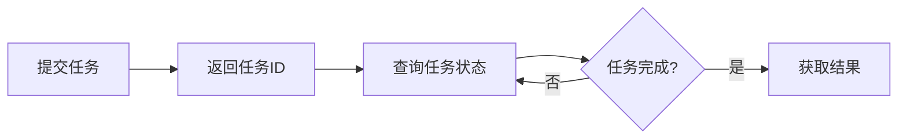

# 异步接口文档

> **版本**: v2.0.0
> **更新日期**: 2026-01-09

---

## 概述

系统提供多种异步接口，用于执行耗时操作（如四性检测、ERP 同步、批量导入等）。
异步接口采用"提交-查询-获取结果"的模式，避免长时间阻塞请求。

---

## 异步任务流程



---

## 四性检测异步接口

### 1. 提交检测任务

**接口**: `POST /api/compliance/four-nature/{archiveId}/async`

**请求示例**:

```http
POST /api/compliance/four-nature/123456/async
Authorization: Bearer <token>
```

**响应示例**:

```json
{
  "code": 200,
  "message": "success",
  "data": {
    "taskId": "task-uuid-123",
    "archiveId": "123456",
    "archiveCode": "COMP001-2024-10Y-FIN-AC01-V9900"
  }
}
```

### 2. 查询任务状态

**接口**: `GET /api/compliance/four-nature/tasks/{taskId}`

**请求示例**:

```http
GET /api/compliance/four-nature/tasks/task-uuid-123
Authorization: Bearer <token>
```

**响应示例**:

```json
{
  "code": 200,
  "message": "success",
  "data": {
    "taskId": "task-uuid-123",
    "status": "RUNNING",
    "progress": 50,
    "currentCheck": "INTEGRITY",
    "startedAt": "2026-01-09T10:00:00",
    "estimatedCompletionAt": "2026-01-09T10:02:00"
  }
}
```

**任务状态说明**:

| 状态 | 说明 |
|------|------|
| PENDING | 排队中 |
| RUNNING | 执行中 |
| COMPLETED | 已完成 |
| FAILED | 失败 |
| CANCELLED | 已取消 |

### 3. 获取检测结果

**接口**: `GET /api/compliance/four-nature/tasks/{taskId}/result`

**请求示例**:

```http
GET /api/compliance/four-nature/tasks/task-uuid-123/result
Authorization: Bearer <token>
```

**响应示例**:

```json
{
  "code": 200,
  "message": "success",
  "data": {
    "archiveId": "123456",
    "archiveCode": "COMP001-2024-10Y-FIN-AC01-V9900",
    "checks": {
      "authenticity": {
        "passed": true,
        "details": "数字签名验证通过"
      },
      "integrity": {
        "passed": true,
        "details": "SM3哈希校验通过"
      },
      "usability": {
        "passed": true,
        "details": "文件格式验证通过"
      },
      "safety": {
        "passed": true,
        "details": "病毒扫描通过"
      }
    },
    "overallPassed": true,
    "checkedAt": "2026-01-09T10:02:00"
  }
}
```

### 4. 取消任务

**接口**: `DELETE /api/compliance/four-nature/tasks/{taskId}`

**请求示例**:

```http
DELETE /api/compliance/four-nature/tasks/task-uuid-123
Authorization: Bearer <token>
```

**响应示例**:

```json
{
  "code": 200,
  "message": "success",
  "data": true
}
```

---

## ERP 同步异步接口

### 1. 提交同步任务

**接口**: `POST /api/erp/scenario/{id}/sync`

**请求示例**:

```http
POST /api/erp/scenario/1/sync
Authorization: Bearer <token>
```

**响应示例**:

```json
{
  "code": 200,
  "message": "success",
  "data": {
    "taskId": "sync-task-123",
    "scenarioId": 1,
    "scenarioName": "YonSuite 凭证同步",
    "status": "SUBMITTED",
    "submittedAt": "2026-01-09T10:00:00"
  }
}
```

### 2. 查询同步状态

**接口**: `GET /api/erp/scenario/{id}/sync/status/{taskId}`

**请求示例**:

```http
GET /api/erp/scenario/1/sync/status/sync-task-123
Authorization: Bearer <token>
```

**响应示例**:

```json
{
  "code": 200,
  "message": "success",
  "data": {
    "taskId": "sync-task-123",
    "scenarioId": 1,
    "status": "RUNNING",
    "progress": 30,
    "syncedCount": 30,
    "failedCount": 0,
    "totalCount": 100,
    "startedAt": "2026-01-09T10:00:00",
    "estimatedCompletionAt": "2026-01-09T10:05:00",
    "lastSyncedAt": "2026-01-09T10:01:30"
  }
}
```

### 3. 获取同步任务列表

**接口**: `GET /api/erp/scenario/{id}/sync/tasks`

**请求示例**:

```http
GET /api/erp/scenario/1/sync/tasks?page=1&limit=20
Authorization: Bearer <token>
```

---

## 异步任务监控接口

### 获取所有线程池状态

**接口**: `GET /api/admin/async/thread-pools`

**权限**: `SYSTEM_ADMIN` 或 `AUDIT_ADMIN`

**请求示例**:

```http
GET /api/admin/async/thread-pools
Authorization: Bearer <token>
```

**响应示例**:

```json
{
  "code": 200,
  "message": "success",
  "data": {
    "taskExecutor": {
      "executorName": "taskExecutor",
      "activeCount": 2,
      "corePoolSize": 4,
      "maximumPoolSize": 8,
      "queueSize": 5,
      "queueCapacity": 100,
      "completedTaskCount": 100,
      "taskCount": 102,
      "isShutdown": false,
      "usagePercent": 25.0
    },
    "erpSyncExecutor": {
      "executorName": "erpSyncExecutor",
      "activeCount": 1,
      "corePoolSize": 2,
      "maximumPoolSize": 4,
      "queueSize": 0,
      "queueCapacity": 50,
      "completedTaskCount": 50,
      "taskCount": 51,
      "isShutdown": false,
      "usagePercent": 25.0
    },
    "fourNatureCheckExecutor": {
      "executorName": "fourNatureCheckExecutor",
      "activeCount": 3,
      "corePoolSize": 4,
      "maximumPoolSize": 8,
      "queueSize": 2,
      "queueCapacity": 50,
      "completedTaskCount": 200,
      "taskCount": 203,
      "isShutdown": false,
      "usagePercent": 37.5
    }
  }
}
```

### 获取单个线程池状态

**接口**: `GET /api/admin/async/thread-pools/{executorName}`

**请求示例**:

```http
GET /api/admin/async/thread-pools/erpSyncExecutor
Authorization: Bearer <token>
```

### 获取线程池健康状态

**接口**: `GET /api/admin/async/health`

**响应示例**:

```json
{
  "code": 200,
  "message": "success",
  "data": {
    "taskExecutor": true,
    "erpSyncExecutor": true,
    "fourNatureCheckExecutor": true,
    "batchOperationExecutor": true,
    "reconciliationExecutor": true
  }
}
```

### 获取线程池概要信息

**接口**: `GET /api/admin/async/summary`

**响应示例**:

```json
{
  "code": 200,
  "message": "success",
  "data": {
    "executorCount": 5,
    "totalActiveThreads": 10,
    "totalMaxThreads": 32,
    "totalCompletedTasks": 550,
    "totalQueuedTasks": 15,
    "overallUsagePercent": 31.25
  }
}
```

---

## 客户端实现示例

### JavaScript/Axios 轮询实现

```javascript
class AsyncTaskManager {
  constructor(apiClient) {
    this.apiClient = apiClient;
    this.pollInterval = 2000; // 2秒轮询间隔
  }

  // 提交异步四性检测任务
  async submitFourNatureCheck(archiveId) {
    const response = await this.apiClient.post(
      `/compliance/four-nature/${archiveId}/async`
    );
    return response.data.data.taskId;
  }

  // 轮询任务状态直到完成
  async pollTaskStatus(taskId, onUpdate) {
    return new Promise((resolve, reject) => {
      const poll = async () => {
        try {
          const response = await this.apiClient.get(
            `/compliance/four-nature/tasks/${taskId}`
          );
          const status = response.data.data;

          // 调用进度回调
          if (onUpdate) {
            onUpdate(status);
          }

          // 检查是否完成
          if (status.status === 'COMPLETED') {
            resolve(status);
          } else if (status.status === 'FAILED' || status.status === 'CANCELLED') {
            reject(new Error(status.errorMessage || '任务失败'));
          } else {
            // 继续轮询
            setTimeout(poll, this.pollInterval);
          }
        } catch (error) {
          reject(error);
        }
      };

      poll();
    });
  }

  // 获取检测结果
  async getCheckResult(taskId) {
    const response = await this.apiClient.get(
      `/compliance/four-nature/tasks/${taskId}/result`
    );
    return response.data.data;
  }

  // 完整的检测流程
  async checkArchive(archiveId, onProgress) {
    try {
      // 1. 提交任务
      onProgress?.({ message: '正在提交检测任务...' });
      const taskId = await this.submitFourNatureCheck(archiveId);

      // 2. 轮询状态
      onProgress?.({ message: '正在进行四性检测...' });
      await this.pollTaskStatus(taskId, (status) => {
        onProgress?.({
          message: `检测中... ${status.progress}%`,
          progress: status.progress
        });
      });

      // 3. 获取结果
      onProgress?.({ message: '正在获取检测结果...' });
      const result = await this.getCheckResult(taskId);

      return result;
    } catch (error) {
      throw error;
    }
  }
}

// 使用示例
const taskManager = new AsyncTaskManager(axios);

taskManager.checkArchive('123456', (progress) => {
  console.log(progress.message);
  // 更新UI进度条
  updateProgressBar(progress.progress);
}).then(result => {
  console.log('检测完成:', result);
  showResult(result);
}).catch(error => {
  console.error('检测失败:', error);
  showError(error.message);
});
```

### React Hook 实现

```typescript
import { useState, useEffect, useCallback } from 'react';
import axios from 'axios';

interface AsyncTaskState {
  status: 'IDLE' | 'RUNNING' | 'COMPLETED' | 'FAILED';
  progress: number;
  error: string | null;
  data: any;
}

export function useAsyncTask() {
  const [taskState, setTaskState] = useState<AsyncTaskState>({
    status: 'IDLE',
    progress: 0,
    error: null,
    data: null
  });

  const submitTask = useCallback(async (url: string, taskIdUrl: string) => {
    try {
      // 提交任务
      setTaskState({ status: 'RUNNING', progress: 0, error: null, data: null });

      const submitResponse = await axios.post(url);
      const taskId = submitResponse.data.data.taskId;

      // 轮询状态
      const pollInterval = setInterval(async () => {
        const statusResponse = await axios.get(`${taskIdUrl}/${taskId}`);
        const status = statusResponse.data.data;

        setTaskState(prev => ({
          ...prev,
          progress: status.progress || 0
        }));

        if (status.status === 'COMPLETED') {
          clearInterval(pollInterval);
          setTaskState({
            status: 'COMPLETED',
            progress: 100,
            error: null,
            data: status
          });
        } else if (status.status === 'FAILED') {
          clearInterval(pollInterval);
          setTaskState({
            status: 'FAILED',
            progress: 0,
            error: status.errorMessage || '任务失败',
            data: null
          });
        }
      }, 2000);

    } catch (error: any) {
      setTaskState({
        status: 'FAILED',
        progress: 0,
        error: error.message,
        data: null
      });
    }
  }, []);

  const reset = useCallback(() => {
    setTaskState({
      status: 'IDLE',
      progress: 0,
      error: null,
      data: null
    });
  }, []);

  return { taskState, submitTask, reset };
}

// 使用示例
function FourNatureCheckButton({ archiveId }) {
  const { taskState, submitTask, reset } = useAsyncTask();

  const handleSubmit = () => {
    submitTask(
      `/api/compliance/four-nature/${archiveId}/async`,
      '/api/compliance/four-nature/tasks'
    );
  };

  return (
    <div>
      <button
        onClick={handleSubmit}
        disabled={taskState.status === 'RUNNING'}
      >
        {taskState.status === 'RUNNING' ? '检测中...' : '开始检测'}
      </button>

      {taskState.status === 'RUNNING' && (
        <progress value={taskState.progress} max={100} />
      )}

      {taskState.status === 'COMPLETED' && (
        <div>检测完成！</div>
      )}

      {taskState.status === 'FAILED' && (
        <div>检测失败: {taskState.error}</div>
      )}
    </div>
  );
}
```

---

## 性能说明

### 并发限制

| 线程池 | 核心线程 | 最大线程 | 队列容量 | 用途 |
|--------|----------|----------|----------|------|
| taskExecutor | 4 | 8 | 100 | 通用异步任务 |
| erpSyncExecutor | 2 | 4 | 50 | ERP 同步 |
| fourNatureCheckExecutor | 4 | 8 | 50 | 四性检测 |
| batchOperationExecutor | 2 | 4 | 20 | 批量操作 |
| reconciliationExecutor | 2 | 4 | 20 | 对账任务 |

### 超时配置

| 任务类型 | 超时时间 |
|----------|----------|
| 四性检测 | 5 分钟 |
| ERP 同步 | 30 分钟 |
| 批量导入 | 1 小时 |
| 批量操作 | 10 分钟 |

---

## 更新日志

### v2.0.0 (2026-01-09)

- 新增异步任务监控接口
- 新增线程池状态查询
- 优化任务状态轮询机制
- 新增客户端实现示例

### v1.0.0 (2025-12-01)

- 初始版本
- 四性检测异步接口
- ERP 同步异步接口
