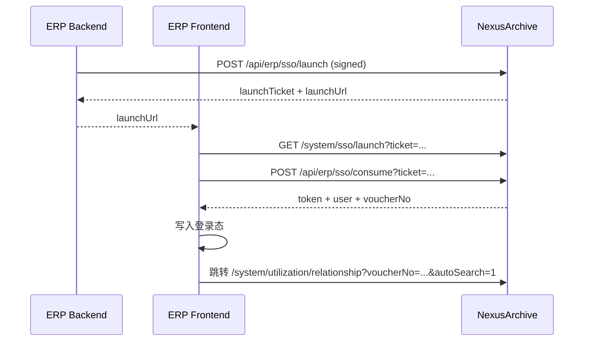

# ERP 发起联查 SSO 对接文档

> 适用场景：ERP 用户在 ERP 页面点击“发起联查”，无感进入 NexusArchive 穿透联查页面，并自动带入凭证号发起查询。

## 1. 总体流程

1. ERP 后端调用 `POST /api/erp/sso/launch`，提交账套编码、工号、凭证号。
2. NexusArchive 校验签名、时间戳、nonce、防重放、账套映射、用户映射。
3. 校验通过后返回一次性 `launchTicket`（60 秒有效）。
4. ERP 前端跳转 `launchUrl`（`/system/sso/launch?ticket=...`）。
5. 前端落地页调用 `POST /api/erp/sso/consume?ticket=...`。
6. NexusArchive 消费 ticket（一次性），返回 `token + user + voucherNo`。
7. 前端写入登录态并跳转 `/system/utilization/relationship?voucherNo=xxx&autoSearch=1`。

## 2. 接口定义

### 2.1 发起联查（换取 launchTicket）

- Method: `POST`
- URL: `/api/erp/sso/launch`
- Headers:
  - `X-Client-Id`: ERP 客户端标识
  - `X-Signature`: HMAC-SHA256(Base64)
- Body:

```json
{
  "accbookCode": "BR01",
  "erpUserJobNo": "1001",
  "voucherNo": "记-8",
  "timestamp": 1739230000,
  "nonce": "a6a4f0e5d2"
}
```

成功响应示例：

```json
{
  "code": 200,
  "message": "操作成功",
  "data": {
    "launchTicket": "3a6f7d...",
    "expiresInSeconds": 60,
    "launchUrl": "/system/sso/launch?ticket=3a6f7d..."
  }
}
```

### 2.2 消费 ticket（换取登录态）

- Method: `POST`
- URL: `/api/erp/sso/consume?ticket={launchTicket}`

成功响应示例：

```json
{
  "code": 200,
  "message": "操作成功",
  "data": {
    "token": "<jwt>",
    "user": {
      "id": "u1",
      "username": "zhangsan",
      "roles": ["archive_user"],
      "permissions": ["archive:view"]
    },
    "voucherNo": "记-8"
  }
}
```

## 3. 签名规范（HMAC）

- 算法：`HMAC-SHA256`
- 编码：`Base64`
- 参与签名原文（固定顺序、分隔符 `|`）：

`clientId|timestamp|nonce|accbookCode|erpUserJobNo|voucherNo`

示例原文：

`ERP_A|1739230000|a6a4f0e5d2|BR01|1001|记-8`

服务端校验规则：
1. 时间戳窗口：默认 `±300s`
2. nonce 防重放：同一 `clientId + nonce` 仅允许一次
3. 签名比对：常量时间比较

## 4. 映射与前置数据

### 4.1 账套映射（严格唯一）

- ERP 仅传 `accbookCode`
- NexusArchive 内部解析 `fondsCode`
- 规则：
  - 未命中：`ACCBOOK_MAPPING_NOT_FOUND`
  - 命中多条：`ACCBOOK_MAPPING_DUPLICATE`
  - 仅一条：通过

### 4.2 用户映射（工号）

- ERP 传 `erpUserJobNo`
- NexusArchive 从映射表查询 `nexusUserId`
- 找不到映射：`USER_MAPPING_NOT_FOUND`

## 5. 错误码

| 错误码 | 含义 | 建议处理 |
| --- | --- | --- |
| `INVALID_SIGNATURE` | 签名无效 | 检查签名串拼接顺序、密钥、编码 |
| `TIMESTAMP_EXPIRED` | 时间戳过期/漂移过大 | 校准 ERP 服务器时钟 |
| `NONCE_REPLAYED` | nonce 重放 | 每次请求生成新 nonce |
| `CLIENT_NOT_FOUND` | clientId 不存在或禁用 | 检查客户端配置状态 |
| `USER_MAPPING_NOT_FOUND` | 工号未映射 Nexus 用户 | 补齐用户映射 |
| `ACCBOOK_MAPPING_NOT_FOUND` | 账套未配置全宗映射 | 补齐账套映射 |
| `ACCBOOK_MAPPING_DUPLICATE` | 账套映射不唯一 | 清理重复映射 |
| `TICKET_NOT_FOUND` | ticket 不存在 | 检查 ticket 参数 |
| `TICKET_EXPIRED` | ticket 已过期 | 重新调用 launch |
| `TICKET_ALREADY_USED` | ticket 已消费 | 重新调用 launch |

## 6. 时序图



## 7. 联调检查清单

1. `erp_sso_client` 已配置 `clientId/clientSecret` 且状态为 `ACTIVE`。
2. `erp_user_mapping` 已导入工号映射，`(clientId, erpUserJobNo)` 唯一。
3. `accbookCode -> fondsCode` 映射已配置且全局唯一。
4. ERP 请求头、签名串顺序、时间戳单位（秒）一致。
5. ERP 跳转后浏览器最终落在穿透联查页面，并自动检索目标凭证。

## 8. 环境参数单（可直接填写并转发）

> 用途：给 ERP 开发、运维、项目经理统一确认接入信息。  
> 说明：本章节可直接复制到邮件/IM 群公告，按环境填值。

### 8.1 环境参数

| 环境 | Base URL | clientId | clientSecret | 备注 |
| --- | --- | --- | --- | --- |
| TEST | `https://` |  |  | 联调环境 |
| UAT | `https://` |  |  | 验收环境 |
| PROD | `https://` |  |  | 生产环境 |

### 8.2 固定接口路径

- `POST {BaseURL}/api/erp/sso/launch`
- `POST {BaseURL}/api/erp/sso/consume?ticket=...`

### 8.3 固定调用规范

- 鉴权方式：`X-Client-Id` + `X-Signature`（HMAC-SHA256 + Base64）
- 时间戳：Unix 秒级时间戳
- 时间窗口：`±300s`
- nonce：每次请求唯一
- ticket：一次性 + 60 秒有效

### 8.4 超时与重试建议

- 连接超时：`3s`
- 读取超时：`3s`
- 重试：仅网络异常/5xx，最多 3 次（200ms/500ms/1000ms）
- 业务错误码（4xx）：不重试，按错误码提示并上报

### 8.5 联调前置映射（必须）

1. 用户映射：`erpUserJobNo -> nexusUserId` 已导入
2. 账套映射：`accbookCode -> fondsCode` 已配置且全局唯一

### 8.6 联调联系人与窗口

- ERP 接口负责人：
- NexusArchive 接口负责人：
- 联调时间窗口：

### 8.7 首次联调回传日志字段（脱敏）

- `clientId`
- `erpUserJobNo`
- `accbookCode`
- `voucherNo`
- `errorCode`
- `traceId`

## 9. 附录：签名计算示例（Java / Node）

### 9.1 Node.js 示例

```js
import crypto from 'crypto';

const clientId = 'ERP_A';
const clientSecret = 'YOUR_CLIENT_SECRET';
const body = {
  accbookCode: 'BR01',
  erpUserJobNo: '1001',
  voucherNo: '记-8',
  timestamp: Math.floor(Date.now() / 1000),
  nonce: crypto.randomBytes(8).toString('hex'),
};

const payload = [
  clientId,
  body.timestamp,
  body.nonce,
  body.accbookCode,
  body.erpUserJobNo,
  body.voucherNo,
].join('|');

const signature = crypto
  .createHmac('sha256', clientSecret)
  .update(payload, 'utf8')
  .digest('base64');

console.log({ payload, signature, body });
```

### 9.2 Java 示例

```java
import javax.crypto.Mac;
import javax.crypto.spec.SecretKeySpec;
import java.nio.charset.StandardCharsets;
import java.util.Base64;

public class ErpSsoSignDemo {
    public static String sign(String payload, String secret) throws Exception {
        Mac mac = Mac.getInstance("HmacSHA256");
        mac.init(new SecretKeySpec(secret.getBytes(StandardCharsets.UTF_8), "HmacSHA256"));
        byte[] out = mac.doFinal(payload.getBytes(StandardCharsets.UTF_8));
        return Base64.getEncoder().encodeToString(out);
    }

    public static void main(String[] args) throws Exception {
        String clientId = "ERP_A";
        String timestamp = "1739230000";
        String nonce = "a6a4f0e5d2";
        String accbookCode = "BR01";
        String erpUserJobNo = "1001";
        String voucherNo = "记-8";

        String payload = String.join("|",
                clientId, timestamp, nonce, accbookCode, erpUserJobNo, voucherNo);
        String signature = sign(payload, "YOUR_CLIENT_SECRET");

        System.out.println("payload=" + payload);
        System.out.println("signature=" + signature);
    }
}
```
