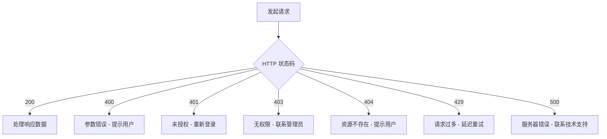

# NexusArchive 错误码文档

> **版本**: v2.0.0
> **更新日期**: 2026-01-09

---

## 目录

1. [错误响应格式](#错误响应格式)
2. [HTTP 状态码](#http-状态码)
3. [业务错误码](#业务错误码)
4. [错误处理建议](#错误处理建议)

---

## 错误响应格式

### 标准错误响应

```json
{
  "code": 400,
  "message": "参数错误",
  "data": null,
  "timestamp": "2026-01-09T10:00:00",
  "path": "/api/archives"
}
```

### 验证错误响应

```json
{
  "code": 400,
  "message": "参数验证失败",
  "data": {
    "errors": [
      {
        "field": "amount",
        "message": "金额必须大于0"
      }
    ]
  }
}
```

---

## HTTP 状态码

| 状态码 | 名称 | 说明 | 示例场景 |
|--------|------|------|----------|
| 200 | OK | 请求成功 | 查询成功 |
| 201 | Created | 创建成功 | 创建档案成功 |
| 204 | No Content | 无内容 | 删除成功 |
| 400 | Bad Request | 参数错误 | 必填参数缺失 |
| 401 | Unauthorized | 未授权 | Token 过期 |
| 403 | Forbidden | 无权限 | 无全宗访问权限 |
| 404 | Not Found | 资源不存在 | 档案不存在 |
| 409 | Conflict | 资源冲突 | 档案编号重复 |
| 413 | Payload Too Large | 请求体过大 | 文件超过限制 |
| 415 | Unsupported Media Type | 不支持的媒体类型 | 文件格式不支持 |
| 429 | Too Many Requests | 请求过多 | 触发限流 |
| 500 | Internal Server Error | 服务器错误 | 系统异常 |
| 503 | Service Unavailable | 服务不可用 | 系统维护中 |

---

## 业务错误码

### 1xxx - 认证授权

| 错误码 | 说明 | 解决方案 |
|--------|------|----------|
| 1001 | 用户名或密码错误 | 检查用户名密码 |
| 1002 | Token 过期 | 重新登录获取新 Token |
| 1003 | Token 无效 | 检查 Token 格式 |
| 1004 | 用户已被锁定 | 联系管理员解锁 |
| 1005 | 用户已被禁用 | 联系管理员 |
| 1006 | 密码过期 | 修改密码 |
| 1007 | 缺少必需的权限 | 联系管理员分配权限 |
| 1008 | 会话已失效 | 重新登录 |
| 1009 | MFA 验证失败 | 重新输入验证码 |
| 1010 | 账户未激活 | 联系管理员激活账户 |

### 2xxx - 档案管理

| 错误码 | 说明 | 解决方案 |
|--------|------|----------|
| 2001 | 档案不存在 | 检查档案 ID |
| 2002 | 档案已删除 | 无法操作已删除的档案 |
| 2003 | 档案编号重复 | 使用其他编号 |
| 2004 | 档案状态不允许操作 | 检查档案当前状态 |
| 2005 | 档案关联文件不存在 | 检查关联文件 |
| 2006 | 档案已归档 | 无法修改已归档档案 |
| 2007 | 档案未归档 | 无法操作未归档档案 |
| 2008 | 档案审批中 | 等待审批完成 |
| 2009 | 档案已被锁定 | 联系锁定用户或管理员 |
| 2010 | 案卷不存在 | 检查案卷 ID |
| 2011 | 案卷已满 | 添加新案卷 |
| 2012 | 档案分类不存在 | 检查分类 ID |

### 3xxx - 全宗管理

| 错误码 | 说明 | 解决方案 |
|--------|------|----------|
| 3001 | 全宗不存在 | 检查全宗 ID |
| 3002 | 用户无全宗权限 | 联系管理员分配全宗权限 |
| 3003 | 全宗编号重复 | 使用其他编号 |
| 3004 | 全宗已关闭 | 无法操作已关闭全宗 |
| 3005 | 全宗下有档案无法删除 | 先删除或转移档案 |
| 3006 | 全宗隔离违规 | 检查跨全宗操作 |
| 3007 | 默认全宗无法删除 | 使用其他全宗作为默认 |

### 4xxx - ERP 集成

| 错误码 | 说明 | 解决方案 |
|--------|------|----------|
| 4001 | ERP 连接失败 | 检查 ERP 配置和网络 |
| 4002 | ERP 同步失败 | 查看详细错误信息 |
| 4003 | ERP 配置不存在 | 检查配置 ID |
| 4004 | ERP 凭证无效 | 更新 ERP 凭证 |
| 4005 | ERP 场景不存在 | 检查场景 ID |
| 4006 | ERP 同步任务不存在 | 检查任务 ID |
| 4007 | ERP 同步任务已取消 | 无法操作已取消的任务 |
| 4008 | ERP 映射配置错误 | 检查映射配置 |
| 4009 | ERP 数据解析失败 | 检查 ERP 数据格式 |
| 4010 | ERP 账套未配置 | 配置账套映射 |
| 4011 | ERP 接口调用超时 | 重试或检查网络 |
| 4012 | ERP 返回错误 | 查看 ERP 错误信息 |

### 5xxx - 文件管理

| 错误码 | 说明 | 解决方案 |
|--------|------|----------|
| 5001 | 文件上传失败 | 检查文件大小和格式 |
| 5002 | 文件格式不支持 | 使用支持的格式 |
| 5003 | 文件不存在 | 检查文件路径 |
| 5004 | 文件已存在 | 使用其他文件名 |
| 5005 | 文件大小超限 | 压缩文件或分批上传 |
| 5006 | 文件类型检测失败 | 检查文件内容 |
| 5007 | 文件存储空间不足 | 清理存储空间 |
| 5008 | 文件删除失败 | 检查文件权限 |
| 5009 | 文件校验失败 | 文件可能损坏 |
| 5010 | 病毒扫描失败 | 检查文件安全性 |

### 6xxx - 审计日志

| 错误码 | 说明 | 解决方案 |
|--------|------|----------|
| 6001 | 审计日志验证失败 | 日志可能被篡改 |
| 6002 | 审计日志不存在 | 检查日志 ID |
| 6003 | 审计日志链断裂 | 联系技术支持 |
| 6004 | 审计日志导出失败 | 检查导出参数 |
| 6005 | 审计日志已归档 | 无法修改已归档日志 |

### 7xxx - License 管理

| 错误码 | 说明 | 解决方案 |
|--------|------|----------|
| 7001 | License 无效 | 检查 License 文件 |
| 7002 | License 已过期 | 更新 License |
| 7003 | License 节点数超限 | 减少节点或升级 License |
| 7004 | License 功能未授权 | 升级 License |
| 7005 | License 签名验证失败 | 检查 License 完整性 |

### 8xxx - 合规性检查

| 错误码 | 说明 | 解决方案 |
|--------|------|----------|
| 8001 | 四性检测失败 | 查看详细检测报告 |
| 8002 | 数字签名验证失败 | 检查签名文件 |
| 8003 | 文件完整性校验失败 | 文件可能被修改 |
| 8004 | 文件格式不兼容 | 转换文件格式 |
| 8005 | 病毒扫描发现威胁 | 清除病毒后重新上传 |
| 8006 | 检测任务不存在 | 检查任务 ID |
| 8007 | 检测任务已取消 | 无法操作已取消的任务 |
| 8008 | 检测任务执行中 | 等待任务完成或取消任务 |

### 9xxx - 系统错误

| 错误码 | 说明 | 解决方案 |
|--------|------|----------|
| 9001 | 数据库连接失败 | 检查数据库配置 |
| 9002 | Redis 连接失败 | 检查 Redis 配置 |
| 9003 | 系统繁忙 | 稍后重试 |
| 9004 | 系统维护中 | 等待维护完成 |
| 9005 | 配置错误 | 检查系统配置 |
| 9006 | 服务不可用 | 联系技术支持 |
| 9007 | 限流触发 | 降低请求频率 |
| 9008 | 线程池满 | 稍后重试 |

---

## 错误处理建议

### 客户端错误处理流程



### 重试策略

| 错误码 | 是否重试 | 重试延迟 | 最大重试次数 |
|--------|----------|----------|--------------|
| 4001 (ERP 连接失败) | 是 | 5s | 3 |
| 4011 (ERP 超时) | 是 | 10s | 2 |
| 4002 (ERP 同步失败) | 否 | - | - |
| 9003 (系统繁忙) | 是 | 2s | 5 |
| 9007 (限流触发) | 是 | 60s | 无限制 |
| 5001 (文件上传失败) | 是 | 3s | 3 |

### 错误提示建议

```javascript
// 前端错误处理示例
function handleApiError(error) {
  const { code, message } = error.response.data;

  switch (code) {
    case 1001:
      showError('用户名或密码错误，请重新输入');
      break;
    case 1002:
    case 1003:
      showError('登录已过期，请重新登录');
      redirectToLogin();
      break;
    case 2001:
      showError('档案不存在，请刷新后重试');
      break;
    case 3002:
      showError('您没有该全宗的访问权限，请联系管理员');
      break;
    case 4001:
      showError('ERP 系统连接失败，请稍后重试');
      break;
    case 5001:
      showError('文件上传失败，请检查文件格式和大小');
      break;
    case 8005:
      showError('文件检测到病毒威胁，请使用安全文件');
      break;
    case 9003:
      showError('系统繁忙，请稍后重试');
      break;
    default:
      showError(message || '操作失败，请稍后重试');
  }
}
```

---

## 更新日志

### v2.0.0 (2026-01-09)

- 新增 ERP 集成错误码 (4xxx)
- 新增合规性检查错误码 (8xxx)
- 优化错误码分类
- 新增重试策略建议

### v1.0.0 (2025-12-01)

- 初始版本
- 基础错误码定义
