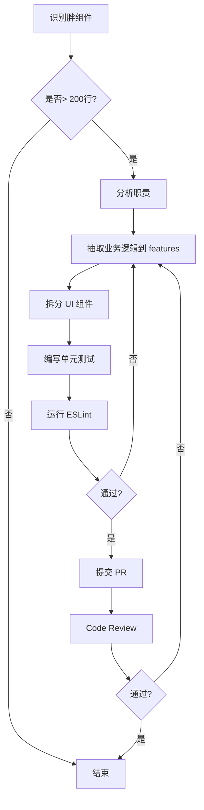

# 前端代码持续优化指南

> **目标**: 防止架构边界腐蚀，维持代码库健康  
> **执行频率**: 每季度 / 每次重大重构前

---

## 📋 "胖组件"审查清单

### 定义
满足以下任一条件的组件被视为"胖组件"：
- ✅ **行数** > 150行（不含注释）
- ✅ **复杂业务逻辑** > 50行
- ✅ **直接 API 调用** ≥ 3个
- ✅ **状态管理** > 8 个 `useState`

### 审查步骤

#### 1. 发现胖组件
```bash
# 查找大文件
find src/components -name "*.tsx" -exec wc -l {} \; | sort -rn | head -20
```

#### 2. 分析依赖
```bash
# 检查 API 调用数量
grep -r "client\.\(get\|post\|put\|delete\)" src/components/archive --include="*.tsx" | wc -l
```

#### 3. 制定重构计划
对于每个胖组件，填写以下表格：

| 组件路径 | 当前行数 | 主要问题 | 拆分方案 | 负责人 | 完成时间 |
|:---|:---|:---|:---|:---|:---|
| `ArchiveListView.tsx` | 2418 | 业务逻辑混杂 | 抽取 hooks 到 `features/archives` | 张三 | 2024-Q1 |

---

## 🔍 定期 Code Review 检查点

### PR Review 时必查
1. **新增组件位置正确性**
   - [ ] 纯 UI 组件放在 `components/common`
   - [ ] 页面组件放在 `components/[domain]`
   - [ ] 业务逻辑 hooks 放在 `features/[domain]`

2. **依赖合规性**
   - [ ] ESLint 通过 (`npm run lint`)
   - [ ] 无循环依赖

3. **可维护性**
   - [ ] 单文件 < 200行
   - [ ] 函数平均长度 < 30行
   - [ ] 每个组件只做一件事

### 按月抽查
```bash
# 每月1号运行
npm run lint
npm run test:coverage
```

检查：
- Lint 错误数 ≤ 5
- 测试覆盖率 ≥ 70%
- 无关键路径的技术债

---

## 🛠 重构工作流程

### 标准重构流程



### 重构技巧

#### 技巧 1: 逐步抽取 Hooks
```tsx
// 前: 200+ 行的巨型组件
export function ArchiveList() {
  const [archives, setArchives] = useState([]);
  const [loading, setLoading] = useState(false);
  
  useEffect(() => {
    // 50+ 行数据加载逻辑
  }, []);
  
  const handleSubmit = () => {
    // 30+ 行提交逻辑
  };
  
  return <div>...</div>;
}

// 后: 清晰的职责分离
// features/archives/hooks.ts
export function useArchiveList() {
  const [archives, setArchives] = useState([]);
  const [loading, setLoading] = useState(false);
  
  const loadArchives = async () => { /* ... */ };
  const handleSubmit = async () => { /* ... */ };
  
  return { archives, loading, loadArchives, handleSubmit };
}

// components/archive/ArchiveList.tsx (现在只有 50 行)
export function ArchiveList() {
  const { archives, loading, handleSubmit } = useArchiveList();
  return <ArchiveTable data={archives} loading={loading} onSubmit={handleSubmit} />;
}
```

#### 技巧 2: 提取通用 UI 组件
```tsx
// 前: 重复的表单逻辑
<form>
  <input placeholder="名称" />
  <textarea placeholder="描述" />
  <button type="submit">提交</button>
</form>

// 后: 通用表单组件
// components/common/Form.tsx
export function Form({ fields, onSubmit }) { /* ... */ }

// 使用
<Form
  fields={[
    { name: 'title', type: 'text', placeholder: '名称' },
    { name: 'desc', type: 'textarea', placeholder: '描述' }
  ]}
  onSubmit={handleSubmit}
/>
```

---

## 📊 度量指标

### 健康度看板（每月更新）

| 指标 | 目标值 | 当前值 | 趋势 |
|:---|:---|:---|:---|
| 平均组件行数 | < 100 | 142 | ⬇ |
| 胖组件数量 | < 5 | 8 | ➡ |
| ESLint 错误 | 0 | 3 | ⬇ |
| 架构边界违规 | 0 | 1 | ⬇ |
| 测试覆盖率 | > 70% | 68% | ⬆ |

---

## 🎯 季度 OKR 示例

### Q1 2025 目标
**O**: 将前端代码库架构合规率提升至 100%

**KRs**:
1. 全部胖组件（当前 8 个）重构完成
2. ESLint 错误清零
3. 新增 20 个单元测试，覆盖核心业务逻辑
4. 完成团队架构规则培训（100% 参与率）

---

## 🚨 技术债务管理

### 债务分级

| 级别 | 描述 | 处理时间 | 示例 |
|:---|:---|:---|:---|
| **P0 (紧急)** | 阻塞上线 | 立即 | 架构边界违规导致编译失败 |
| **P1 (高)** | 影响迭代 | 本周 | 胖组件 > 500 行 |
| **P2 (中)** | 长期风险 | 本月 | 缺失单元测试 |
| **P3 (低)** | 优化项 | 本季度 | 代码格式不统一 |

### 债务清单模板
```markdown
## 技术债务清单 (2025-Q1)

### P1
- [ ] 重构 `ArchiveListView.tsx` (2418 行)
  - 责任人: 张三
  - 截止日期: 2025-01-15

### P2
- [ ] 补充 `useArchiveForm` 单元测试
  - 责任人: 李四
  - 截止日期: 2025-01-31
```

---

## 📅 执行计划 (模板)

### 每周
- [ ] 周一: 检查上周 PR 的 ESLint 通过率
- [ ] 周五: 识别本周新增的潜在胖组件

### 每月
- [ ] 1号: 运行全量 Lint + Coverage
- [ ] 15号: 团队分享会 - 讨论本月代码改进
- [ ] 月末: 更新技术债务清单

### 每季度
- [ ] 季度初: 制定 OKR
- [ ] 季度中: Code Review 专项行动（2天集中重构）
- [ ] 季度末: OKR 复盘 + 架构规则培训

---

## 🛡 自动化检查

### Pre-commit Hook (推荐)
```bash
# .husky/pre-commit
npm run lint
npm run test:run
```

### CI/CD 集成
参见 [.github/workflows/frontend-quality.yml](file:///Users/user/nexusarchive/.github/workflows/frontend-quality.yml)

---

**记住**: 代码质量不是一次性工作，而是持续投入。每周花 1 小时维护，远胜于每年花 1 个月重构。
