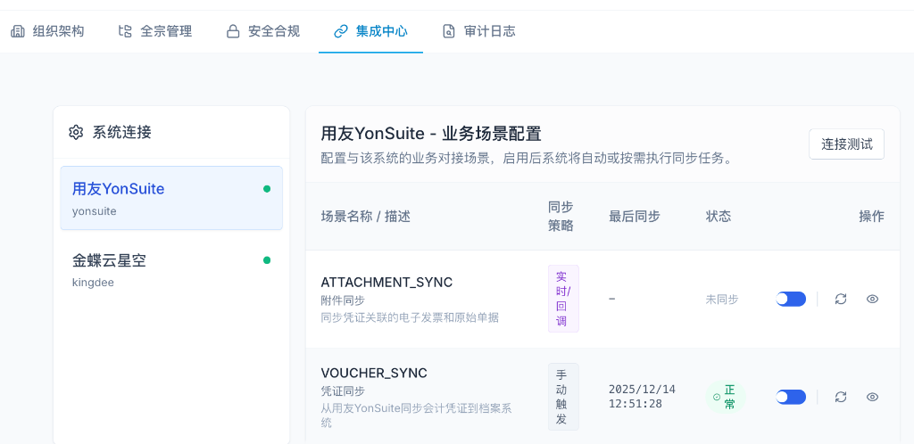
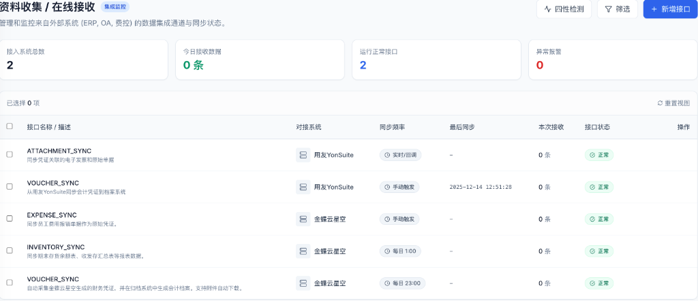

# ERP 集成系统操作手册

本文档旨在明确“集成中心”与“在线接收”两个核心页面的功能定位、使用场景及操作流程。

## 1. 核心概念与页面区分

系统提供了两个核心页面来管理 ERP 集成，它们分别服务于“配置”和“运维”两个不同的场景。

| 页面特征 | 集成中心 (Integration Center) | 在线接收 (Online Reception) |
| :--- | :--- | :--- |
| **菜单路径** | `设置 -> 集成中心` | `资料收集 -> 在线接收` |
| **核心职能** | **控制平面 (Configuration)** | **数据平面 (Operation)** |
| **适用角色** | 系统管理员 (IT) | 档案管理员 / 业务运维 |
| **主要用途** | 管道建设、开关控制、策略设定 | 流量监控、状态检查、手动执行 |
| **典型操作** | • 修改 AppKey/Secret • 连接测试 • 启用/停用业务场景 • 设置自动同步时间 (Cron) | • 查看今日接收量 • 检查接口健康状态 • **手动触发业务数据同步** |

### 界面概览

**图 1：集成中心 —— 用于“修路”**
> 这里是 IT 人员工作的后台。你在这里配置“水管”接哪里，什么时候开闸。

**图 2：在线接收 —— 用于“接水”**
> 这里是业务人员工作的监控台。你在这里看“水”流过来了没有，或者手动打一桶水。

---

## 2. 操作场景一：对接新系统

**场景描述**：企业新引入了一个业务系统（如金蝶 Cloud），需要将其接入档案系统。

**操作入口**：**集成中心**

**标准流程**：
1.  **进入配置页**：点击左侧菜单 `设置` -> `集成中心`。
2.  **选择系统**：在左侧“系统连接”列表中，点击需要配置的系统（如“金蝶云星空”）。如果列表中没有，请联系开发商定制适配器。
3.  **配置参数**：
    *   **基础 URL**：输入 ERP 系统的 API 服务地址。
    *   **认证信息**：填写 AppKey 和 AppSecret。
    *   **额外配置**：如账套 ID (AcctID) 等。
4.  **连接测试**：点击右上角的 `连接测试` 按钮。
    *   ✅ **成功**：显示“连接测试成功”，表示网络和认证通过。
    *   ❌ **失败**：请检查 URL 和密钥是否正确，或检查防火墙设置。
5.  **启用场景**：在右侧列表中，找到需要开启的业务场景（如 `VOUCHER_SYNC`），点击 **状态开关** 启用它。

---

## 3. 操作场景二：日常数据同步

**场景描述**：财务每月结账后，档案员需要手动将上个月的凭证同步到档案系统。

**操作入口**：**资料收集 -> 在线接收**

**标准流程**：
1.  **进入接收页**：点击左侧菜单 `资料收集` -> `在线接收`。
2.  **定位接口**：在列表中找到对应的接口行。
    *   例如：对接系统为 `用友YonSuite`，接口名称为 `VOUCHER_SYNC` (凭证同步)。
3.  **触发同步**：点击该行最右侧的 **同步图标** (🌀 蓝色循环箭头)。
4.  **选择参数**：
    *   系统弹出“同步配置”对话框。
    *   选择 **会计期间**（如 `2025-08`）。
    *   点击 **确认同步**。
5.  **结果确认**：
    *   系统提示“同步任务已触发”。
    *   后台将根据预设策略（通常为自动计算增量或当前期间）执行同步。
    *   前往 `审计日志` 查看详细的同步结果和抓取的凭证数量。

---

## 4. 常见问题 (FAQ)

**Q1: 我想同步数据，但在“在线接收”里找不到对应的系统怎么办？**
**A**: 请先去“集成中心”检查该系统的业务场景是否已**启用**。未启用（开关关闭）的场景不会出现在在线接收列表中。

**Q2: “同步策略”是什么意思？**
**A**: 在“集成中心”设置。
*   **Manual (手动)**：仅支持在“在线接收”页面人工点击同步（适用于月结频次）。
*   **Cron (定时)**：系统按设定时间自动执行（如每天凌晨）。
*   **Realtime (实时)**：对方系统通过回调推送数据（需要对方系统支持）。

**Q3: 为什么同步报错“500 系统内部错误”？**
**A**: 通常是服务器端问题。请联系运维人员查看后台日志 `logs/backend.log`。

**Q4: 我不仅想同步凭证，还想同步附件，怎么做？**
**A**: 通常 `VOUCHER_SYNC` (凭证同步) 场景会自动包含附件下载逻辑。或者检查是否有独立的 `ATTACHMENT_SYNC` 场景并在“在线接收”中触发它。
