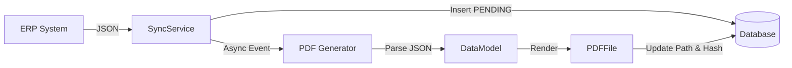

# ERP Integration & Electronic File Generation (ERP 集成与电子文件生成)

## 1. Data Synchronization Principles (数据同步原则)

### 1.1 Robust JSON Parsing (健壮的 JSON 解析)
External ERP systems (like YonSuite, Kingdee) may imply implied or changing data structures. The integration layer **MUST** be resilient:
*   **Flexible Key Lookup**: Do not assume a single key name. Check multiple possibilities (e.g., `description`, `digest`, `desc`, `摘要`).
*   **Structure Agnostic**: Handle both direct arrays and nested objects (e.g., `body` vs `bodies` vs root array).
*   **Case Insensitivity**: Support snake_case (`debit_original`), camelCase (`debitOriginal`), and lowercase keys.
*   **Null Safety**: Always handle `null` or missing nodes gracefully using `path()` instead of `get()`.

### 1.2 Database Constraints (数据库约束)
*   **Multi-Stage Processing**: When a process involves multiple stages (e.g., Sync -> Generate PDF -> Update DB), the initial insert **MUST** satisfy all database constraints (e.g., `NOT NULL` columns).
*   **Placeholder Values**: Use meaningful placeholders (e.g., `pending/sys/id.json` for `storage_path`) if the final value is not yet available, rather than leaving it null or empty.

## 2. Electronic File Generation (电子文件生成)

### 2.1 PDF Generation Standards
*   **Content Completeness**: Generated PDFs must contain all critical voucher information:
    - Header: Voucher Type, Number, Date, Entity.
    - Body: Entries with Summary, Subject (Code + Name), Currency, Debit/Credit Amounts.
    - Footer: Maker, Approver, Bookkeeper.
*   **Font Support**: Must use fonts that support simplified Chinese (e.g., `SimSun`, `SourceHanSans`) to avoid garbage characters.

### 2.2 Frontend Preview Compatibility
*   **MIME Type consistency**: The backend `fileType` (e.g., `application/pdf`) must be strictly compatible with the frontend viewer's detection logic.
*   **Strict Typing**: Frontend components (like `OfdViewer`) should explicitly handle standard MIME types (`application/pdf`) rather than just relying on file extensions to avoid "fake preview" failures.

## 3. Recommended Workflow

