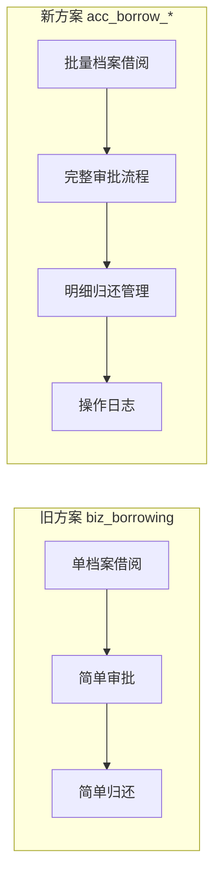

# 借阅模块架构重构实现计划

**日期**: 2026-01-13  
**目标**: 废弃旧的 `biz_borrowing` 实现，迁移到 `acc_borrow_*` 表体系  
**状态**: 🔄 待审批

---

## 1. 现状分析

### 1.1 双轨制问题

| 维度 | 旧方案 (`biz_borrowing`) | 新方案 (`acc_borrow_*`) |
|------|-------------------------|------------------------|
| **Entity** | `modules.borrowing.domain.Borrowing` | `entity.BorrowRequest` |
| **表结构** | 单表、单档案借阅 | 三表、多档案批量借阅 |
| **Service** | ✅ 已实现 `BorrowingApplicationService` | ❌ 未实现 |
| **Controller** | ✅ 已实现 `BorrowingController` | ❌ 未实现 |
| **审批流程** | 简化（无审批人记录） | 完整（审批人、时间、意见） |
| **归还管理** | 简化（无归还操作人） | 完整（操作人、损坏记录） |

### 1.2 功能对比



---

## 2. 决策

> [!IMPORTANT]
> **决定：废弃 `biz_borrowing` 实现，全面迁移到 `acc_borrow_*` 体系。**

理由：
1. `acc_borrow_*` 表结构更完善，支持 DA/T 94-2022 合规要求
2. 支持多档案批量借阅，更符合实际业务场景
3. 完整的审计追踪（审批人、归还操作人、损坏记录）
4. 避免维护两套代码的负担

---

## 3. 提议的变更

### 3.1 新增文件

#### [NEW] `domain/borrow/SubmitBorrowRequestCommand.java`

不可变的 Command 对象，包含完整的校验逻辑：

```java
public record SubmitBorrowRequestCommand(
    String userId,
    String userName,
    String deptId,
    String deptName,
    String purpose,
    String borrowType,  // READING, COPY, LOAN
    List<String> archiveIds,
    LocalDate expectedStartDate,
    LocalDate expectedEndDate
) {
    // Compact constructor with validation
}
```

---

#### [NEW] `service/borrow/BorrowRequestService.java`

纯粹的服务接口，遵循"深奥的简洁"风格：

```java
public interface BorrowRequestService {
    BorrowRequest submit(SubmitBorrowRequestCommand command);
    void approve(String requestId, String approverId, String approverName, boolean approved, String comment);
    void confirmBorrow(String requestId, String operatorId);
    void returnArchives(String requestId, String operatorId, List<String> archiveIds);
    Page<BorrowRequest> query(BorrowRequestQuery query);
}
```

---

#### [NEW] `service/borrow/impl/BorrowRequestServiceImpl.java`

实现类，包含完整业务逻辑：

- 生成借阅单号 (`BL-YYYYMMDD-序号`)
- 创建 `acc_borrow_request` 记录
- 批量创建 `acc_borrow_archive` 明细记录
- 状态流转管理
- 归还时更新明细记录

---

#### [NEW] `mapper/BorrowRequestMapper.java` & `BorrowArchiveMapper.java`

MyBatis-Plus Mapper 接口。

---

#### [NEW] `controller/BorrowRequestController.java`

新的 REST API 控制器，使用 `/api/borrow/requests` 路径。

---

### 3.2 废弃/删除文件

| 文件 | 处理方式 |
|------|----------|
| `modules/borrowing/` 整个目录 | 标记 `@Deprecated`，后续版本删除 |
| `BorrowingController.java` | 保留但添加弃用警告 |

---

### 3.3 数据库变更

无需额外迁移脚本，`V20260113__fix_acc_borrow_log_schema.sql` 已创建所需表。

---

## 4. API 设计

### 4.1 新 API 端点

| 方法 | 路径 | 描述 |
|------|------|------|
| `POST` | `/api/borrow/requests` | 提交借阅申请 |
| `GET` | `/api/borrow/requests` | 查询借阅申请列表 |
| `GET` | `/api/borrow/requests/{id}` | 获取借阅详情（含档案明细） |
| `POST` | `/api/borrow/requests/{id}/approve` | 审批借阅申请 |
| `POST` | `/api/borrow/requests/{id}/confirm-borrow` | 确认借出 |
| `POST` | `/api/borrow/requests/{id}/return` | 归还档案 |

### 4.2 请求/响应示例

```json
// POST /api/borrow/requests
{
  "purpose": "年度审计需要",
  "borrowType": "READING",
  "archiveIds": ["arc001", "arc002", "arc003"],
  "expectedStartDate": "2026-01-14",
  "expectedEndDate": "2026-01-28"
}

// Response
{
  "id": "br-xxx",
  "requestNo": "BL-20260113-0001",
  "status": "PENDING",
  "archiveCount": 3,
  "archives": [
    {"archiveId": "arc001", "archiveCode": "...", "archiveTitle": "..."},
    ...
  ]
}
```

---

## 5. 验证计划

### 5.1 单元测试

```bash
# 运行借阅服务测试
cd nexusarchive-java
mvn test -Dtest=BorrowRequestServiceTest
```

新增测试用例：
- `testSubmitBorrowRequest_Success`
- `testSubmitBorrowRequest_EmptyArchives_ThrowsException`
- `testApprove_Success`
- `testReturnArchives_PartialReturn`

### 5.2 集成测试

```bash
# 运行集成测试
mvn test -Dtest=BorrowRequestControllerIT
```

### 5.3 手动验证

1. 启动开发环境：`./scripts/dev-start.sh`
2. 使用 Swagger UI 测试 API：`http://localhost:8080/swagger-ui.html`
3. 测试完整流程：
   - 提交借阅申请（选择多个档案）
   - 查看待审批列表
   - 审批通过
   - 确认借出
   - 归还部分档案
   - 归还全部档案

---

## 6. 实施步骤

1. [ ] 创建 `SubmitBorrowRequestCommand` Command 类
2. [ ] 创建 `BorrowRequestService` 接口和实现
3. [ ] 创建 `BorrowRequestMapper` 和 `BorrowArchiveMapper`
4. [ ] 创建 `BorrowRequestController`
5. [ ] 编写单元测试
6. [ ] 标记旧 `modules/borrowing` 为 `@Deprecated`
7. [ ] 手动测试完整流程

---

## 7. 风险与缓解

| 风险 | 影响 | 缓解措施 |
|------|------|----------|
| 前端依赖旧 API | 功能中断 | 保留旧 Controller，添加弃用警告 |
| 数据迁移 | 历史数据丢失 | `biz_borrowing` 中的数据量应很少，可手动迁移 |
| 测试覆盖不足 | 引入 Bug | 编写完整的单元测试和集成测试 |

---

## 8. 待确认

> [!WARNING]
> 请确认以下事项：

1. **是否需要迁移 `biz_borrowing` 中的历史数据？**
2. **前端是否已有借阅申请相关页面？需要同步修改吗？**
3. **是否需要保留旧 API 的兼容层？**
