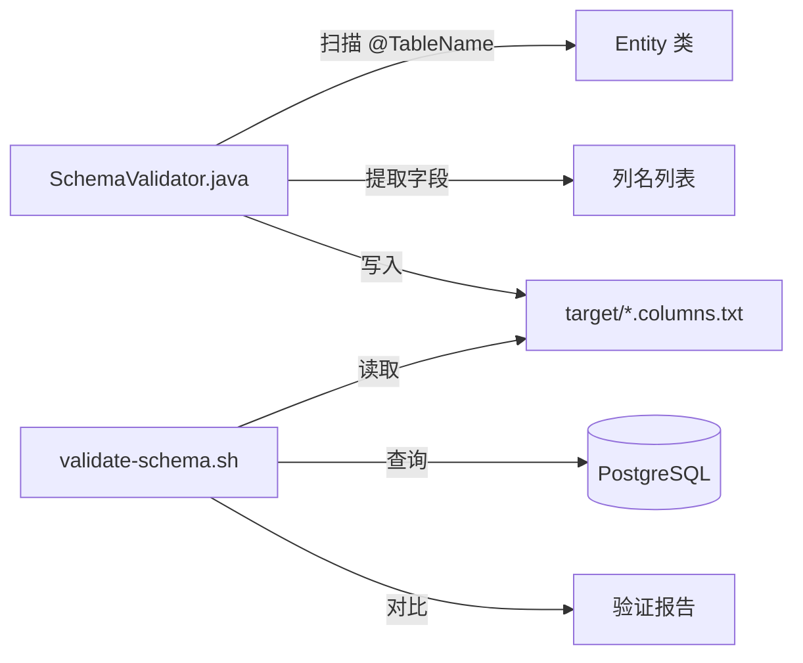

# Schema 验证自动化工具实现计划

**日期**: 2026-01-13  
**目标**: 实现 Entity-Schema 自动化验证工具，消除手动维护验证脚本的需要  
**状态**: ✅ **已实施并验证通过**

---

## 👨‍💻 审查结论 (2026-01-13)

### 代码质量评估

| 组件 | 评分 | 评价 |
|------|------|------|
| `SchemaValidator.java` | ⭐⭐⭐⭐⭐ | 实现简洁、正确处理了继承字段、正确排除 ES 实体 |
| `pom.xml` 插件配置 | ⭐⭐⭐⭐⭐ | 正确配置了 `process-classes` 阶段和 `classpathScope` |
| `validate-schema.sh` | ⭐⭐⭐⭐⭐ | Docker fallback 设计优秀，错误处理完善 |

### 验证发现

工具成功扫描了 **60 个表**，发现 **3 个表存在问题**（已修复）：

| 表名 | 对应 Entity | 问题 | 状态 |
|------|-------------|------|------|
| `acc_borrow_request` | `BorrowRequest.java` | 表不存在 | ✅ 已修复 |
| `acc_borrow_archive` | `BorrowArchive.java` | 表不存在 | ✅ 已修复 |
| `acc_borrow_log` | `BorrowLog.java` | 表结构与 Entity 不匹配 | ✅ 已修复 |

> [!TIP]
> 已创建修复迁移脚本 `V20260113__fix_acc_borrow_log_schema.sql`，使用幂等语法确保在任何环境中都能正确执行。

---

## 1. 背景与问题

当前 `scripts/validate-schema.sh` 存在以下问题：

1. **硬编码列名**: 仅验证 `arc_file_content` 表，列名列表是手动维护的
2. **覆盖范围有限**: 项目有 60+ 个 Entity 类，但只验证了 1 个表
3. **维护成本高**: 每次修改 Entity 字段都需要手动更新脚本
4. **容易遗漏**: 人工维护容易出错，历史上发生过 `certificate` 列遗漏事件

---

## 2. 技术发现

> [!IMPORTANT]
> 项目使用的是 **MyBatis-Plus** 的 `@TableName` 注解，而非标准 JPA 的 `@Entity` 注解。

### 2.1 Entity 注解模式

```java
@TableName("arc_file_content")
public class ArcFileContent {
    @TableId(type = IdType.ASSIGN_ID)
    private String id;

    @TableField(value = "created_time", fill = FieldFill.INSERT)
    private LocalDateTime createdTime;

    @TableField(exist = false)  // 非数据库字段，需排除
    private Map<String, Object> highlightMetaMap;
}
```

### 2.2 命名转换规则

- **默认规则**: Java 驼峰 → 数据库蛇形 (`archivalCode` → `archival_code`)
- **显式指定**: 使用 `@TableField(value = "column_name")`
- **排除字段**: `@TableField(exist = false)` 标记的字段不对应数据库列

---

## 3. 实现方案

### 3.1 方案选型

| 方案 | 优点 | 缺点 |
|------|------|------|
| **A: Reflections 库** | 成熟的类扫描库 | 需要新增依赖 |
| **B: 纯 Java 反射** | 无需额外依赖 | 需要手动加载类 |
| **C: Spring 上下文扫描** | 集成于现有框架 | 需要启动完整上下文，较重 |

**选择方案 B**: 纯 Java 反射 + 编译时扫描

理由：
1. 避免引入新依赖
2. 可以作为独立工具在构建阶段运行
3. 已有 Guava 库可用于驼峰转蛇形

---

## 4. 提议的变更

### 4.1 组件架构



---

### 4.2 文件变更

#### [NEW] [SchemaValidator.java](file:///Users/user/nexusarchive/nexusarchive-java/src/main/java/com/nexusarchive/tools/SchemaValidator.java)

创建 `com.nexusarchive.tools.SchemaValidator` 工具类：

**核心功能**:
1. 扫描 `com.nexusarchive.entity` 包下所有 `@TableName` 注解的类
2. 解析每个字段的数据库列名（处理 `@TableField` 和驼峰转换）
3. 排除 `@TableField(exist = false)` 的字段
4. 将列名列表写入 `target/{table_name}.columns.txt`

**关键逻辑**:
```java
// 驼峰转蛇形
CaseFormat.LOWER_CAMEL.to(CaseFormat.LOWER_UNDERSCORE, fieldName)

// 检查 @TableField(exist = false)
TableField annotation = field.getAnnotation(TableField.class);
if (annotation != null && !annotation.exist()) {
    continue; // 跳过非数据库字段
}

// 优先使用显式列名
if (annotation != null && !annotation.value().isEmpty()) {
    return annotation.value();
}
```

---

#### [MODIFY] [pom.xml](file:///Users/user/nexusarchive/nexusarchive-java/pom.xml)

添加 `exec-maven-plugin` 插件，在 `compile` 阶段后运行 `SchemaValidator`:

```xml
<plugin>
    <groupId>org.codehaus.mojo</groupId>
    <artifactId>exec-maven-plugin</artifactId>
    <version>3.1.0</version>
    <executions>
        <execution>
            <id>generate-schema-columns</id>
            <phase>process-classes</phase>
            <goals>
                <goal>java</goal>
            </goals>
            <configuration>
                <mainClass>com.nexusarchive.tools.SchemaValidator</mainClass>
            </configuration>
        </execution>
    </executions>
</plugin>
```

---

#### [MODIFY] [validate-schema.sh](file:///Users/user/nexusarchive/scripts/validate-schema.sh)

重构脚本以动态读取列名文件：

**Before**:
```bash
ARC_FILE_CONTENT_COLUMNS="
    id
    archival_code
    ...
"
validate_table_schema "arc_file_content" "$ARC_FILE_CONTENT_COLUMNS"
```

**After**:
```bash
# 遍历所有生成的列名文件
for columns_file in "$JAVA_PROJECT/target"/*.columns.txt; do
    table_name=$(basename "$columns_file" .columns.txt)
    expected_columns=$(cat "$columns_file")
    validate_table_schema "$table_name" "$expected_columns"
done
```

---

## 5. 验证计划

### 5.1 自动化测试

```bash
# 步骤 1: 编译并生成列名文件
cd nexusarchive-java
mvn compile

# 步骤 2: 验证列名文件生成
ls -la target/*.columns.txt

# 步骤 3: 运行 Schema 验证脚本
cd ..
./scripts/validate-schema.sh
```

### 5.2 预期输出

```
==========================================
   Entity-Schema 一致性验证工具 v2.0
==========================================

[INFO] 发现 62 个 Entity 类，开始验证...

[✓] 表 arc_file_content Schema验证通过 (30 列)
[✓] 表 bas_fonds Schema验证通过 (8 列)
[✓] 表 sys_user Schema验证通过 (12 列)
...

==========================================
  所有 62 个表 Schema验证通过！
==========================================
```

---

## 6. 风险与缓解

| 风险 | 影响 | 缓解措施 |
|------|------|----------|
| 部分 Entity 无 `@TableName` 注解 | 漏验证 | 工具输出警告，强制所有 Entity 使用 `@TableName` |
| 驼峰转换与实际不一致 | 误报 | 优先使用 `@TableField.value()` 显式指定 |
| Maven 插件执行失败 | 阻塞构建 | 配置 `failOnError=false`，降级为警告 |

---

## 7. 实施步骤

1. [x] 创建 `SchemaValidator.java` 工具类
2. [x] 修改 `pom.xml` 添加 exec-maven-plugin
3. [x] 重构 `validate-schema.sh` 脚本
4. [x] 本地测试：`mvn compile && ./scripts/validate-schema.sh`
5. [ ] 提交代码并更新文档

---

## 8. 待确认事项

> [!WARNING]
> 请确认以下事项后再开始实施：

1. **是否所有需要验证的 Entity 都已使用 `@TableName` 注解？**
   - 查看 `entity/` 目录发现所有 Java 类都使用了该注解
   
2. **是否需要排除某些测试用或临时 Entity？**
   - 建议排除 `es/` 子目录下的 Elasticsearch 专用 Entity

3. **验证失败时是否应该阻断构建流程？**
   - 建议 CI/CD 中设为阻断，本地开发设为警告
