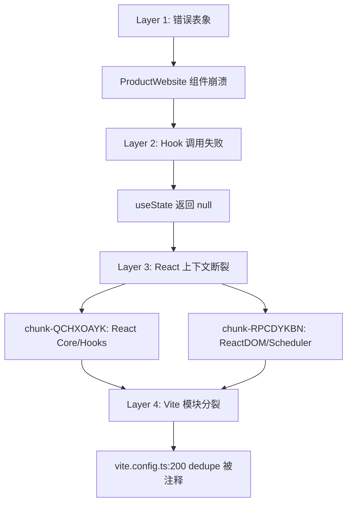

# Fix React Multi-Instance Crash (洋葱型 Bug 修复)

## 问题分析

### 错误表象
```
TypeError: Cannot read properties of null (reading 'useState')
at useState (chunk-QCHXOAYK.js:1066)
at ProductWebsite (index.tsx:31)
```

### 根因链（洋葱模型）



### 第一行问题代码
**文件**: `vite.config.ts`  
**行号**: 200  
**内容**: 
```javascript
// dedupe: ['react', 'react-dom', 'react-router', 'react-router-dom', 'zustand'],
```

`dedupe` 配置被注释掉，导致 Vite 未强制所有依赖共享同一 React 实例。

---

## Proposed Changes

### [MODIFY] [vite.config.ts](file:///Users/user/nexusarchive/vite.config.ts)

取消注释 `dedupe` 配置：

```diff
resolve: {
  alias: { ... },
- // dedupe: ['react', 'react-dom', 'react-router', 'react-router-dom', 'zustand'],
+ dedupe: ['react', 'react-dom', 'react-router', 'react-router-dom', 'zustand'],
},
```

---

## Verification Plan

### 1. 清理 Vite 缓存
```bash
rm -rf node_modules/.vite
```

### 2. 重启前端
```bash
npm run dev:vite
```

### 3. 浏览器验证
1. 打开 `http://localhost:15175/`
2. 确认页面正常加载，无 React Hook 错误
3. 尝试登录并访问 `/system/panorama`
4. 确认控制台无 `useState is null` 或 `Invalid hook call` 错误

### 4. 检查 Vite 依赖预优化
```bash
cat node_modules/.vite/deps/_metadata.json | grep -A2 "react"
```
确认 React 相关模块使用统一的 `browserHash`。
