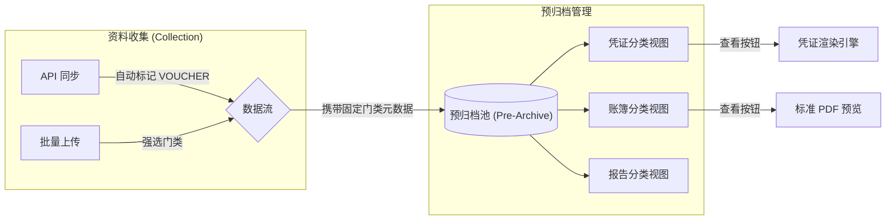

# 头脑风暴：全局档案门类组件与架构解耦方案

## 1. 核心改进理念：所谓“全局”

基于你提供的截图和建议，我们应将“档案门类（ArchivalCategory）”从一个简单的下拉选项提升为系统的**核心元模型**。

### 1.1 全局组件化 (Global Component)
打造一个标准的 `ArchivalCategorySelect` 组件，不仅用于上传，还用于预归档池筛选、归档库搜索。
- **一致性**：核心代码定义在 `src/constants/archive.ts`，确保全系统门类枚举完全一致。
- **业务逻辑绑定**：每个门类自动关联其专属的“描述信息”和“校验规则”。

---

## 2. 职责解耦设计

### 2.1 资料收集模块 (http://localhost:15175/system/collection/)
- **定位**：数据的“漏斗”。只管把东西塞进来。
- **操作逻辑**：
    - **API 自动同步**：系统后台静默执行，如果是凭证同步，自动标记为 `VOUCHER`。
    - **手工批量上传**：如你提供的截图，用户必须在上传时选择门类。
- **强制性**：**无分类元数据的数据禁止流向下一步**。这解决了后端“盲猜”预览模式的问题。

### 2.2 预归档池 (http://localhost:15175/system/pre-archive)
- **定位**：数据的“暂存区/分拣台”。
- **操作逻辑**：
    - 根据收集模块传来的 `archival_category` 自动分库/分页展示。
    - 针对不同门类，工具栏提供不同的“整理工具”（例如凭证类提供“智能关联”，报告类提供“元数据微调”）。

---

## 3. 技术实现：为什么“查看”变简单了？

由于我们在入口（Collection）处做了强限制，系统在任何地方拿到一条数据都知道它的“身份”。

### 3.1 前端预览映射表 (Pre-defined Mapping)
不再需要复杂的 `if-else`，只需要一个简单的映射配置：

```typescript
const PREVIEW_MAP = {
  'VOUCHER': { 
    api: 'VoucherCanvas', 
    upload: 'PdfViewer' 
  },
  'LEDGER': 'PdfViewer',
  'REPORT': 'PdfViewer',
  'OTHER': 'PdfViewer'
};

// 查看按钮只需一行代码：
const Component = PREVIEW_MAP[item.category][item.sourceType] || PREVIEW_MAP[item.category];
```

---

## 4. 业务流示意图 (Mermaid)



---

## 5. 易用性反馈评估

- **合理吗？** 非常合理。这符合档案管理的“前端控制”原则，即在数据产生的瞬间就决定了它的归档属性。
- **方便吗？** 对于用户来说，虽然上传多点了一次鼠标，但后续在预归档池里不用再头疼“这堆乱七八糟的是什么”。
- **改动难度？** **难度为低**。
  - 后端：只需在 `OriginalVoucher` 实体中增加一个必填字段校验。
  - 前端：重构 `pool` 页面的筛选逻辑，从“搜索”变为“按门类路由”。

**基于这个头脑风暴结论，我建议立即弃用“自动嗅探预览”的复杂方案，全面转向这种“元数据驱动”的极简方案。你觉得这个全局组件的视觉呈现上，是否需要针对不同门类使用不同的图标（Icon）以增强识别度？**
